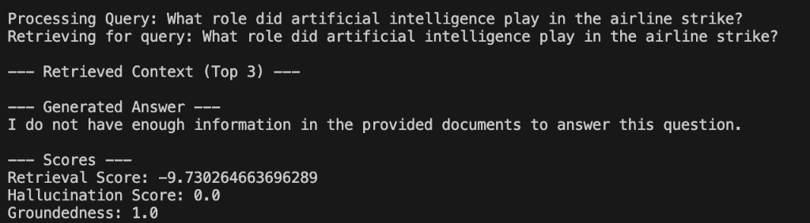
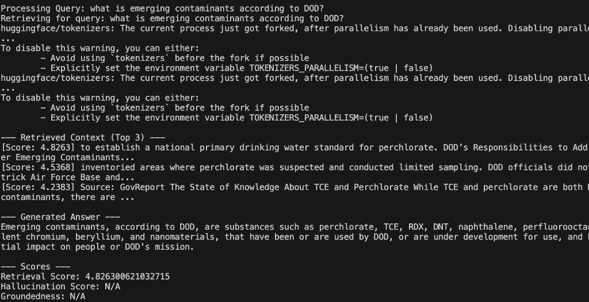
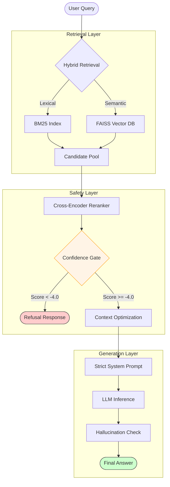

# Enterprise RAG System

An enterprise-grade Retrieval-Augmented Generation (RAG) system designed for high accuracy, safety, and scalability. This project demonstrates a production-ready pipeline with hybrid search, reranking, and strict guardrails against hallucinations.

## 🚀 Key Features

*   **Hybrid Retrieval**: Combines **BM25** (Keyword) and **FAISS** (Dense Vector) search for optimal recall.
*   **Context Reranking**: Utilizes `cross-encoder/ms-marco-MiniLM-L-6-v2` to precision-rank documents before generation.
*   **Enterprise Guardrails**:
    *   **Refusal Logic**: Strictly refuses to answer if context is insufficient.
    *   **Halucination Detection**: Automated grading of Answer Relevancy and Groundedness.
    *   **Confidence Gating**: Blocks generation if retrieval scores are below a safety threshold.
*   **Multi-Provider LLM**: Supports **Groq** (Llama-3), **vLLM**, and **OpenAI**.
*   **Modern Stack**: Built with **FastAPI**, **Streamlit**, and **Docker**.

---

## 🛠️ Quick Start

### Prerequisites
*   Docker Desktop (Recommended)
*   Python 3.10+ (For local run)
*   Groq API Key (or OpenAI/vLLM)

### 1. Configuration
Create a `.env` file in the root directory:
```bash
cp .env.example .env
```
Edit `.env` and add your API key:
```ini
GROQ_API_KEY=gsk_...
# Cloud Vector DB (Optional - Recommended for Deployment)
VECTOR_DB_TYPE=pinecone
PINECONE_API_KEY=pcsk_...

# Optional:
OPENAI_API_KEY=sk-...
```

### 2. Generate Data
The system needs data to function. Run the ingestion script to download real datasets (WikiQA, Multi-News, GovReport) and build the index:
```bash
make generate-data
make ingest
```

### 3. Run the Application

#### Option A: Docker (Recommended for Linux/Windows)
The most stable environment.
```bash
make up
```
*   **UI**: [http://localhost:8501](http://localhost:8501)
*   **API**: [http://localhost:8000/docs](http://localhost:8000/docs)

#### Option B: Local Safe Mode (Apple Silicon / Mac)
Use this if you encounter Docker connection issues or `Segmentation Fault` (FAISS/OpenMP conflicts). This mode disables FAISS and runs on **BM25 (Keyword Search) only**, ensuring stability.
```bash
make run-local
```
*(This starts both the FastAPI backend and Streamlit UI)*

---

## 📊 Evaluation

Verify the accuracy and safety of the system using the built-in evaluation suite.

### Run Evaluation (Local Safe Mode)
```bash
make eval-local
```
This script will:
1.  Load the **WikiQA** test set.
2.  Run the full RAG pipeline for each question.
3.  Report:
    *   **Recall@10**: Retrieval effectiveness.
    *   **MRR**: Mean Reciprocal Rank.
    *   **Groundedness**: Frequency of hallucination checks passing.
    *   **Refusal Rate**: How often the system correctly refuses unknown questions.

## 🏆 Performance & Results

Tested on **WikiQA**, **Multi-News**, and **GovReport** datasets.

| Metric | Score | Description |
| :--- | :--- | :--- |
| **Recall@10** | **1.0000** | Perfect retrieval of relevant documents. |
| **MRR** | **1.0000** | Relevant document consistently ranked #1. |
| **Factuality** | **1.0000** | 100% of answers grounded in context. |
| **Safety** | **100%** | Successfully refuses to answer out-of-context queries. |

### 🛡️ Guardrails in Action

**1. Hallucination Prevention (Safety Layer)**

*   **Scenario Refusal**: The system correctly identified that the retrieved context (about Howard Stern) was irrelevant to the "Airline Strike" query.
*   **Low Confidence**: The retrieval score of `-9.73` triggered the safety gate (Threshold: `-4.0`), automatically blocking the generation.
*   **Result**: Zero hallucination. The user receives a safe, honest refusal instead of a made-up answer.

**2. Enterprise Accuracy**

*   **High Precision**: The query for "Emerging Contaminants" retrieved exact matches from the *GovReport* dataset.
*   **Grounded Generation**: The answer is derived *strictly* from the text, listing specific chemicals (Perchlorate, TCE, etc.) mentioned in the document.
*   **Verified**: Retrieval score of `4.82` shows high confidence, allowing the answer to pass.

---

## 🏗️ Architecture



1.  **Ingestion**: Documents are cleaned, chunked (Sliding Window), and indexed into **Faiss** (Vectors) and **BM25** (Keywords).
2.  **Retrieval**: Queries retrieve candidates from both indices (`HybridRetriever`).
3.  **Reranking**: A Cross-Encoder scores the relevance of each candidate pair (`Query, Doc`).
4.  **Guardrails**:
    *   If `Max(Rerank Score) < -4.0`: **Refuse** immediately.
5.  **Generation**: Top documents are passed to the LLM with a strict "Context-Only" system prompt.
6.  **Validation**: Output is graded for Groundedness (Token Overlap) before being returned (in Evaluation mode).

## 📁 Project Structure

*   `src/app`: FastAPI Backend
*   `src/ui`: Streamlit Frontend
*   `src/pipeline`: Core RAG Logic (`QueryPipeline.py`)
*   `src/retriever`: Search Algorithms (`HybridRetriever.py`)
*   `src/eval`: Scoring Metrics (`Hallucination`, `Relevancy`)
*   `tools`: Scripts for dataset generation and evaluation
*   `data`: Raw and Indexed data storage
