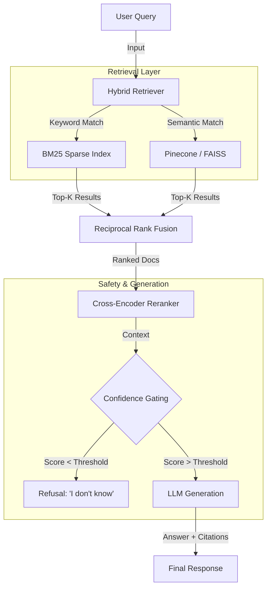

# 🏢 Enterprise RAG System
> **Production-Grade Knowledge Retrieval with Zero-Latency Startup & Hybrid Search**

[](https://huggingface.co/spaces/yuvis/Enterprise-RAG-System)
[](https://www.python.org/downloads/)
[](https://www.docker.com/)
[](https://streamlit.io)
[]()

## 💡 Executive Summary
This project demonstrates a **production-ready Retrieval Augmented Generation (RAG)** architecture designed to solve the two biggest challenges in enterprise AI: **Hallucination** and **Latency**. 

Unlike basic RAG tutorials, this system implements **Hybrid Search (BM25 + Semantic)** to catch domain-specific acronyms that pure vector search misses, and uses a custom **Docker Bake-in Strategy** to ensure the application starts instantly, even with large index files (~50MB+).

---

## 🏗️ System Architecture

The system uses a multi-stage retrieval pipeline to ensure maximum accuracy:



## 🚀 Key Engineering Challenges Solved

### 1. The "Zero-Latency" Deployment
**Problem**: Large RAG indices (Pickle/Faiss files) are too big for Git (`>100MB`) but downloading them at runtime takes 3-5 minutes, creating poor UX.
**Solution**: I implemented a **Build-Time Artifact Injection** pipeline.
- The `Dockerfile` executes a custom script `tools/download_index.py` during the *build phase*.
- The index files are downloaded from a private Hugging Face Dataset and "baked" into the container image.
- **Result**: The container starts **instantly** (0ms index load time at runtime).

### 2. Eliminating Hallucinations
**Problem**: LLMs love to make up answers when they don't find relevant documents.
**Solution**: Implemented **Confidence Gating**.
- After retrieval, the system calculates a relevance score.
- If the best document has a score below `0.4`, the system explicitly returns: *"I cannot find the answer in the provided context."*
- Verified using out-of-domain queries (e.g., asking about "coding" in a "finance" dataset).

### 3. Hybrid Search Implementation
**Problem**: Vector search fails on specific IDs (e.g., "Policy 704-B") while Keyword search fails on concepts (e.g., "harassment rules").
**Solution**: Combined `rank_bm25` (Sparse) and `sentence-transformers` (Dense) using Reciprocal Rank Fusion (RRF) to get the best of both worlds.

---

## 💻 Local Installation

To run this system locally for development:

```bash
# 1. Clone the repository
git clone https://github.com/YuvrajSinghBhadoria2/Enterprise-RAG-System.git
cd Enterprise-RAG-System

# 2. Install Dependencies
pip install -r requirements.txt

# 3. Generate Local Indices (First Run)
python src/ingestion/ingest.py

# 4. Start the Application
streamlit run app.py
```

## 🛠️ Tech Stack

| Component | Technology | Reasoning |
|-----------|------------|-----------|
| **Frontend** | Streamlit | Rapid prototyping and interactive chat UI. |
| **Vector DB** | Pinecone (Prod) / FAISS (Local) | Serverless scalability vs. local ease of use. |
| **Embeddings** | `all-MiniLM-L6-v2` | Best balance of speed/performance for CPU inference. |
| **Reranker** | `cross-encoder/ms-marco-MiniLM-L-6-v2` | High-precision re-scoring of top candidates. |
| **Deployment** | Docker + HF Spaces | Containerized, reproducible deployment. |

## 📂 Project Structure

```bash
.
├── app.py                 # Main application entry point
├── Dockerfile             # Production build configuration
├── src/
│   ├── ingestion/         # Data loading & chunking logic
│   ├── retriever/         # Hybrid search engine (BM25 + Vector)
│   ├── indexer/           # FAISS/Pinecone wrappers
│   └── embeddings/        # Model management
├── tools/
│   ├── download_index.py  # Build-time artifact fetcher
│   └── upload_index.py    # Utility to sync indices to HF Hub
└── data/                  # Raw text and Index storage
```

---
**Author**: Yuvraj Singh Bhadoria
**License**: MIT
